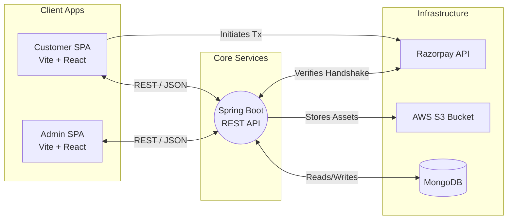

<div align="center">
  
  
  <h1>🍔 BiteRush</h1>
  <p><strong>Next-Generation Online Food Delivery Platform</strong></p>

  <p>
    
    
    
    
    
  </p>

  <p>
    <a href="#-live-demo">Live Demo</a> •
    <a href="#-key-features">Features</a> •
    <a href="#-system-architecture">Architecture</a> •
    <a href="#-tech-stack">Tech Stack</a> •
    <a href="#-getting-started">Getting Started</a> •
    <a href="#-deployment">Deployment</a>
  </p>
</div>

<br/>

## 📖 About the Project

**BiteRush** is an enterprise-grade, full-stack food delivery application built to handle the complete restaurant ordering lifecycle. From browsing a visually rich digital menu to processing secure payments and managing restaurant catalog data—BiteRush delivers a seamless, high-performance experience.

The platform is designed with a service-oriented architecture, featuring distinct frontends for consumers and restaurant managers, all powered by a robust, secure backend API.

---

## 🚀 Live Demo

*Experience the platform live on Vercel:*

| Component | Live URL | Status |
|-----------|----------|--------|
| **🛒 Customer Storefront** | [bite-rush-omega.vercel.app](https://bite-rush-omega.vercel.app) | 🟢 Online |
| **👑 Admin Dashboard** | [bite-rush-admin.vercel.app](https://bite-rush-admin.vercel.app) | 🟢 Online |
| **⚙️ Backend API** | `[Pending Deployment]` | 🟡 Pending |

> **Note:** Ensure your Vercel Project Environment Variables include `VITE_API_URL` pointing to your live backend server to allow the frontends to fetch data.

---

## ✨ Key Features

### 🛒 For Customers
- **🔐 Secure Authentication:** JWT-based login and registration flow.
- **🍔 Interactive Menu:** Dynamic fetching of food items with high-resolution images served directly from **AWS S3**.
- **🛍️ Cart Management:** Fluid add, remove, and quantity adjustment mechanics.
- **💳 Frictionless Payments:** Native **Razorpay** integration for secure, bank-grade checkout processing.
- **📦 Order Tracking:** Real-time visibility into past and active orders.

### 👑 For Administrators
- **📊 Comprehensive Dashboard:** Real-time order management to update fulfillment statuses seamlessly.
- **📝 Catalog Control:** Full CRUD operations for dishes and categories.
- **☁️ Cloud Uploads:** Direct-to-S3 multipart file uploading for attaching mouth-watering images to new menu items instantly.

---

## 🏗 System Architecture

The application implements a decoupled, modern architecture to separate concerns and maximize scalability:



---

## 💻 Tech Stack

| Domain | Technologies |
| :--- | :--- |
| **Backend Core** | Java 21, Spring Boot 3.4.3, Spring Security, Maven |
| **Frontend Apps** | React.js (v18 & v19), Vite, React Router v7, Axios |
| **Database** | MongoDB (via Spring Data MongoDB) |
| **Cloud Services** | AWS S3 (Java SDK) |
| **Payment Gateway**| Razorpay (Test Environment) |
| **Styling & UI** | Bootstrap 5, Custom CSS, React Toastify |

---

## 🛠 Getting Started

### Prerequisites
Before you begin, ensure you have the following installed and configured:
- **Java 21+** & **Node.js (v18+)**
- **MongoDB** running locally on default port `27017`
- Cloud Keys: **AWS S3** Credentials and **Razorpay** Test API Keys

### 1️⃣ Backend Setup (`foodiesapi`)

1. Open your terminal and navigate to the backend folder:
   ```bash
   cd foodiesapi
   ```
2. Create your environment variables in `src/main/resources/application.properties` (or `.env`):
   ```properties
   cloud.aws.credentials.access-key=YOUR_AWS_ACCESS_KEY
   cloud.aws.credentials.secret-key=YOUR_AWS_SECRET_KEY
   cloud.aws.region.static=YOUR_AWS_REGION
   application.bucket.name=YOUR_S3_BUCKET_NAME

   jwt.secret=YOUR_SECURE_RANDOM_STRING_HERE

   razorpay.key.id=YOUR_RAZORPAY_TEST_KEY
   razorpay.key.secret=YOUR_RAZORPAY_TEST_SECRET

   spring.data.mongodb.uri=mongodb://localhost:27017/foodies
   ```
3. Boot up the server:
   ```bash
   ./mvnw spring-boot:run
   ```
   *The API will now be listening on `http://localhost:8080`*

### 2️⃣ Frontend Setup (`foodies` & `adminpanel`)

Both frontends utilize Vite and require the API URL to be injected via environment variables.

1. **Configure Environment:** Create a `.env` file in the root of **both** `foodies` and `adminpanel`:
   ```env
   VITE_API_URL=http://localhost:8080
   ```
2. **Customer App Setup:**
   ```bash
   cd foodies
   # In src/util/contants.js, replace RAZORPAY_KEY with your key
   npm install && npm run dev
   # Server starts at http://localhost:5174
   ```
3. **Admin Panel Setup:**
   ```bash
   cd adminpanel
   npm install && npm run dev
   # Server starts at http://localhost:5173
   ```

---

## 🌐 Environment Variables Guide

When deploying this project (e.g., to Vercel and Render), ensure you map the following variables correctly:

| Variable | Location | Description |
|---|---|---|
| `VITE_API_URL` | Vercel (Both Frontends) | Points to your deployed Spring Boot URL. |
| `jwt.secret` | Backend Host | Used to sign authorization tokens. |
| `cloud.aws.*` | Backend Host | AWS IAM credentials for S3 uploads. |
| `razorpay.key.*` | Backend Host | Used to verify payment signatures securely. |
| `spring.data.mongodb.uri`| Backend Host | Connection string for MongoDB Atlas (or similar). |

---

## 🤝 Contributing

We welcome contributions to make BiteRush even better! 
1. Fork the Project
2. Create your Feature Branch (`git checkout -b feature/AmazingFeature`)
3. Commit your Changes (`git commit -m 'Add some AmazingFeature'`)
4. Push to the Branch (`git push origin feature/AmazingFeature`)
5. Open a Pull Request

<div align="center">
  <br/>
  <p>Built with ❤️ and ☕ for the love of clean code and good food.</p>
</div>
